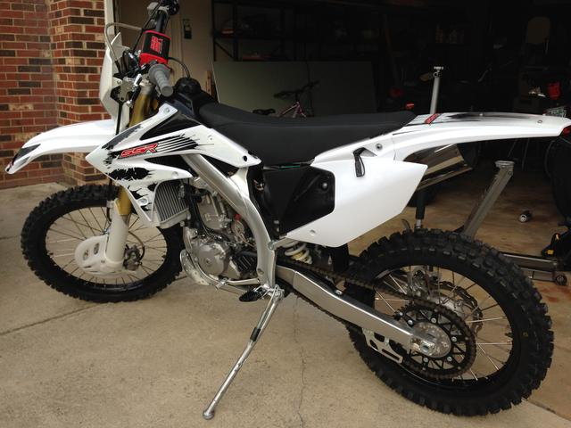
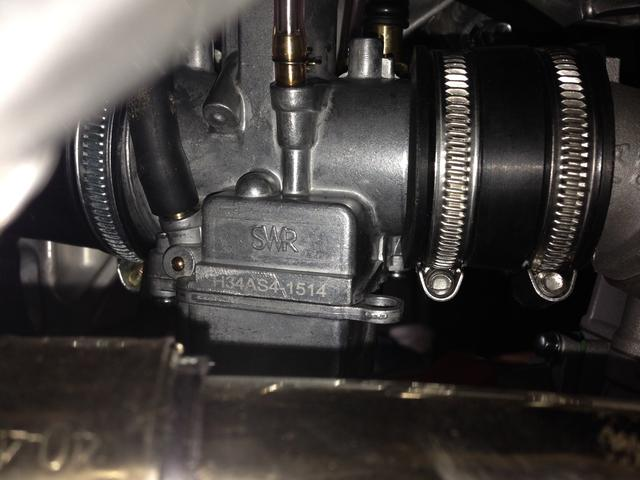
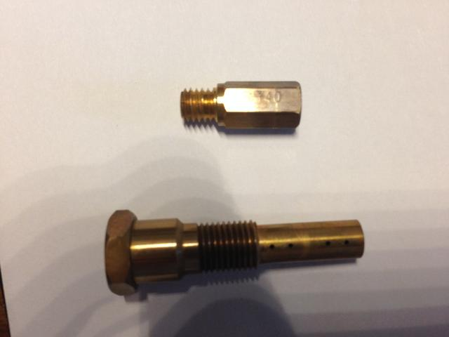
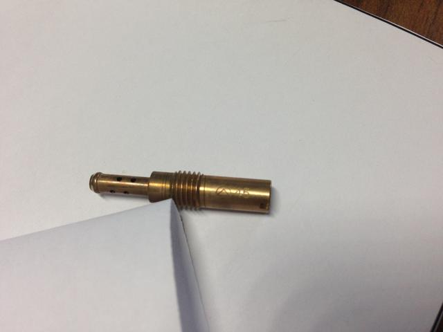
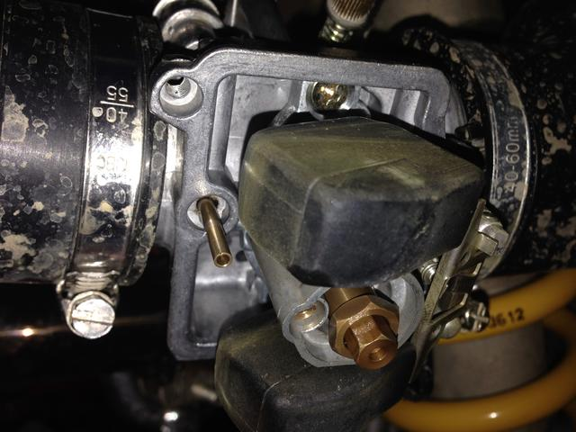
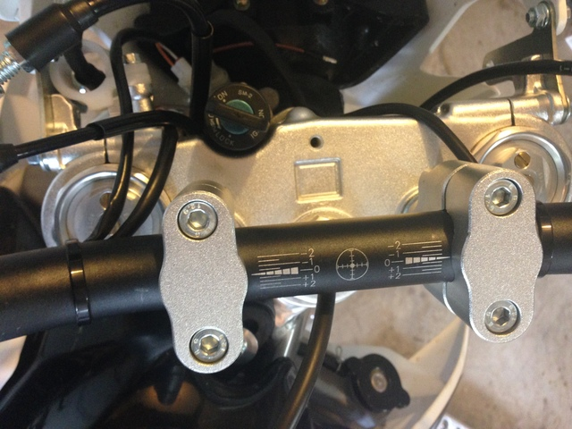
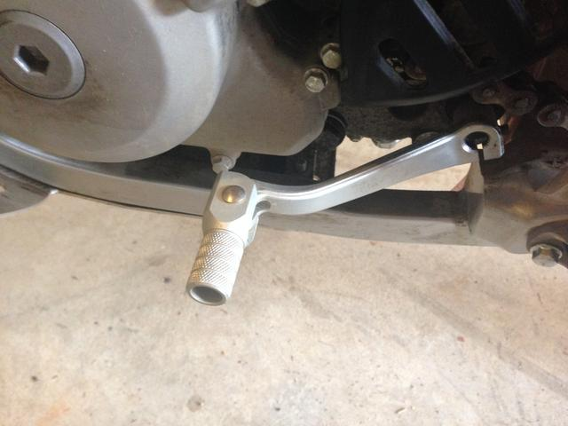
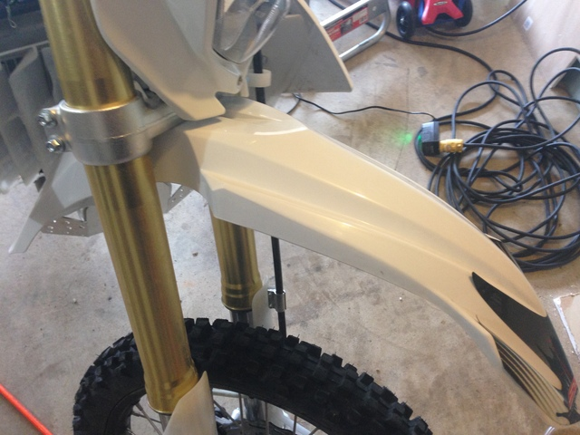
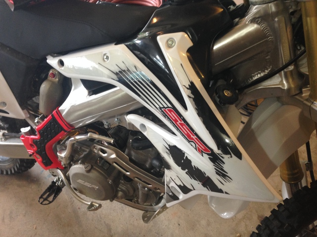

% GooseYArd's SSR SR250S/Asiawing NC250 Information Page
% gooseyard@gmail.com
% Last Update: Tue Sep 27 16:52:48 UTC 2016

A while back, I bought one of my kids an SSR SR70C dirt bike. I was
so impressed with the little bike that later, when I was looking
for a used 250 to ride with my kids, I decided to take a chance on
SSR's larger machine, the SR250C.

Information about these bikes is somewhat hard to come by;
despite their low price, and although the pit bikes seem to sell
pretty well, I've only spoken to a couple of other SR250S owners.

I expect to get a lot details wrong on this page and I count on
readers who know more than I do to set me straight. Please, if you
have corrections or additional information for the page, email it to
me at [gooseyard@gmail.com](mailto:gooseyard@gmail.com "gooseyard@gmail.com").

Overview
========

The NC250 is manufactured by
[Shandong Asiawing Motors Co.,Ltd.](https://www.facebook.com/asiawingmotors/?fref=ts) (their
website appears to be down at the moment I am writing this). It is
distributed to other countries around the world by other importers.
In the United States, the bike is imported by SSR Motorsports and is
known as the SR250S.

In Europe,
[Borossi](http://www.borossi.com/Asiawing-Enduro-SuperMoto/)
distributes the bikes, now under the Asiawing brand.

In Australia, the bike is distributed by
[Crossfire](http://crossfiremotorcycles.com/) as the
[XZ250RR](http://crossfiremotorcycles.com/product/xz250rr/).

The SR250S is patterned on the 2007 model year CRF250X. In most
cases, parts for that bike will fit the SR250S.

Parts Compatibility
===================

Crossfire, who for some time imported the NC250 into Australia as the
XZ250R and XZ250RR, published
[this PDF](XZ250RR_Compatible_Parts_With_Honda_CRF250_and_Honda_CRF450.pdf),
which lists parts compatibility between their bike and the CRF
250/450. I have reformatted the table for the browser and removed the
untranslated chinese.

A [parts diagram](XZ250RPartsManual.pdf) is also available.

I have not verified any of this information, so use at your own risk.

|No|      English Name                             | Material Spec |   Commonality |
|--|:---------------------------------------------:|--------------:|--------------:|
|1 | plastic body                                  |PP             |All the plastic bodys are saame except front side fairing and number plate,but the fixing hole is common use with Honda.|
|2 | front forks                                   | 53x58.5-910   |The structure is same as CRF450 53x58.5-930, but different in length.|
|3 | rear shock                                    | 500           | same as CRF 250|
|4 | linkage, suspension                           | alloy,forged | same as CRF 250|
|5 | linkage, swing arm                            | alloy,forged,cast steel |same as CRF 250|
|6 | guide, chain                                  | PPU |same as CRF 250|
|7 | chain guide insert, rubber                    | PPU |same as CRF 450|
|8 | plate, chain guide                            | aluminium sheet mould| same as CRF 450|
|9 | brake assy,front and rear                     ||same as CRF 450|
|10| seat                                          || same as CRF 250|
|11| guard，disc brake, front (protector)          |PP| same as CRF 250|
|12| guard，disc brake, rear (protector)           |PP| same as CRF 250|
|13| guard, caliper, brake, rear (protector)       |PP| same as CRF 250|
|14| exhaust pipe and muffler                      |aluminium |same as CRF 250|
|15| element, air filter                           | Foam | same as CRF 250|
|16| filter net,air filter                         | stainless steel net| same as CRF 250|
|17| tapered roller bearing,steering stem          |320/28| same as CRF 250|
|18| oil seal, steering stem                       ||same as CRF 250|
|19| holder,fuel tank bandage                      | Rubber and stainless steel| same as CRF 250|
|20| oil seal,middle bolt                          |37-22-4| same as CRF 250|
|21| plane bearing,middle bolt                     |36-22-6| same as CRF 250|
|22| outer bearing,middle bolt                     | 17x30x6 | same as CRF 250|
|23| guard ,air filter,rubber                      |rubber | same as CRF 250|
|24| plate, duct fitting,air filter                |iron sheet mould| same as CRF 250|
|25| holder, filter element,outer and inner        | PA nylon |same as CRF 250|
|26| sub-frame                                     | steel |same as CRF 250|
|27| hub protector, front                          | PE | same as CRF 250|
|28| guard, fork,(protector)                       | PP |same as CRF 250|
|29| clutch lever with carburetor ventilate switch || same as CRF 250|
|30| anti-hot rubber,rear side fairing             | thermostability silica gel| same as CRF 250|
|31| fixed nut,rear fender                         |PE fairing and purposemade nut| same as CRF 250|
|32| tensioner                                     |PPU    |same as CRF 450 |
|33| bracket, brake hose,                          |6063 alloy| same as CRF 250 |
|34| spacer，front fender                          |steel step space| same as CRF 250 |
|35| spcacer,fuel tank fairing                     |steel step space| same as CRF 250 |
|36| bolt,seat                                     |steel step space| same as CRF 250 |

Engine
======

The NC250/SR250S engine is a
[Zongshen ZS177MM](http://www.zse.cc/productsdetail.aspx?ProductsCateId=43&ProductsID=386),
manufactured by [Chongqing Zongshen Power Machinery Company (宗申)](http://en.zongshenmotor.com/).

This engine is also used in a number of other Chinese
motorcycles and scooters, perhaps most notably the Zongshen RX-3
adventure-touring bike, which is distributed in the United States
by the [California Scooter Company](http://www.cscmotorcycles.com/)

The ZS177M is definitely not a clone of the CRF250 engine, at least
not when it comes to service parts like filters.

ZS177MM Parts
-------------

When searching online for SR250S parts, it is helpful to use
"NC250" rather than "SR250S", since the bike is called NC250
everywhere except the US.

Crossfire published this [parts diagram](XZ250RR-Engine-Parts.pdf) for the ZS177MM.

Parts for this motor are plentiful and relatively cheap if you don't
mind having them shipped from abroad.

<http://www.aliexpress.com/store/group/NC250-Parts/207293_251843072.html>

Another option is to purchase parts from CSC for the RX-3:
<http://www.cscmotorcycles.com/OEM-ENGINE-COMPONENTS-s/239.htm>

Oil Filter
----------

The ZS177MM does not use the same oil filter type as the CRF250.

The oil filter included with the bike is a serviceable screen-type
filter, not a pleated paper filter. When changing the engine oil, you
can remove the filter, slide the core out of the screen, and use a
solvent and bristle brush to clean the screen. I used compressed air
to blow out any bits from the screen.

Although I neglected to get a photo of it, I gave the bike an initial
oil change after about 6-8 hours of riding, since many forum trolls
had claimed the filter would be full of shavings as the engine
inevitably destroyed itself after a few hours of use. I found
virtually nothing, a few very fine bits (which I think might've been
from the filter screen itself), and a little bit of ferrous gunk on
the oil drain plug magnet, about what I've seen on any brand new
motorcycle.

I'm going to stick with the serviceable filter for now, although I
think that CSC RX-3 pleated paper filters will fit this motor. I will
be interested to hear if anyone tries it.

By the way, my oil drain plug was sealed with gray hi-temp RTV rather
than a crush washer, although I used a crush washer instead of more
RTV when I made the first oil change.

Carburetor
==========

The NC250 carburetor is manufactured by
[Sunworld Moto](http://www.sunworld.com.tw/en/main/). Mine has
the marking *SWR H34AS4-1514 PHB E34*.

I sent an inquiry to a representative at Sunworld Moto about the
availability of a jet kit for this carb. Sunworld replied
immediately that this carb is made exclusively for the NC250, and
that my distributor would handle parts for it. I spoke to a
representative at SSR, who informed me that a jet kit for a CRF250X
would fit the SWR carb, but I have yet to try this.

Carb Settings
-------------

From the dealer, the factory setting for the air screw was the
standard 2 turns.

The main jet is marked "140", and looks to me like Honda Part no
99101-357-1400, which a Keihin main jet.

The pilot jet is marked "45", and appears to be a standard Keihin PWK/CVK/PE style.

I have not yet removed and measured the needle. I'm hoping that the
Honda needle removal tool (89217-KRN-000) will work with this carb,
but can't confirm yet.

The main jet can be removed with a 6mm driver through the portal on
the bottom of the float bowl after unscrewing the plug. On my carb,
the emulsion tube was torqued slightly less than the jet, so the tube
and jet came out together, no big whoop.

The pilot jet is situated alongside the main jet, but I couldn't get
to it through the portal, and had to remove the bowl.

A word of warning, there's a small breather tube pressed into the bowl
at an angle, which will catch the left float if you pull the bowl
straight down when removing it, which can bend the float. I suggest
removing the small vinyl hose from the bowl first, then jiggle it to
make the tube clear the float.

Fuel
----

The Zongshen and Asiawing manuals recommend 91 or higher octane fuel. I've been using 93 so far.

Exhaust
=======

The stock exhaust on the NC250 has the appearance of an aftermarket
pipe, is fairly light (TKTKg), but lacks an internal spark
arrestor.

I've ordered a
[Lexx Slip-on Exhaust](http://lexx.com.au/honda/exhaust-pipe-slip-on-honda-crf250r-04-05-crf250x-04-11-crf-250)
but haven't received it yet, I'll update the site when I'm sure that
it fits correctly. Several people recommended the FMF PowerCore 4, but
it's about 100$ more than the Lexx.

Suspension
==========
According to Borossi, rear suspension is "rear pergressive FastAce
Performance mono shock absorber with spring preload and rebound and
compression damping" (sic).

I took my rear shock to my local RaceTech dealer,
[MRP Motorsports](https://www.mrpmotorsports.com/), and had the
factory spring rated. The stock spring is 270mm in length, with 58mm
and 60mm ID on the top and bottom ends, respectively. The rate is
6.1kg/mm, which differs considerably from 2007 CRF250X rate of
4.8kg/mm according to
[Racetech](http://www.racetech.com/ProductSearch/1/Honda/CRF250X/2007).

At 250lb, I've resprung mine with a 66 N/mm &Ouml;hlins spring (06310-17),
which &Ouml;hlins lists as a KYB replacement spring. [More Spring Rates](http://www.ohlins.uk.com/ohlins-mx-spring-kits.html).

Also according to Borossi, the front suspension is an 47mm
Upside-Down FastAce Performance fork; rebound and compression
adjustable.

The rear shock fairly easily using
[this method](https://www.youtube.com/watch?v=mnvkLxjvcwA), which
involves removing the pipe and unbolting the subframe, without having
to remove the airbox. I recommend loosening the pipe clamp by the carb
outlet, and have some (I used zip ties) to support the subframe while
the shock is out.

Handlebars and Risers
=====================

The stock handle bar tapers from 1.125" to 0.875" (1 1/8 to 7/8)

I'm tall with a long torso so I like bar risers if I'm standing on the
pegs a lot. I think I'll add some to this bike, but haven't yet.

Shifter
=======

The shifter is of the folding design, similar to the CRF250X
pattern, but I haven't compared them.

Length is about 5" from the front edge to the center line of the
shifter shaft, which I measured as 0.425" (10.8mm?). I crudely
measured this without detaching the shifter. If you are looking for
this measurement let me know, I'll take it off and get a more
accurate measure.

Plastics
========

I haven't determined whether the SR250S plastics are a match with the
CRF, but I've got a couple of photos that might prove useful:

Wiring Diagram
==============

Available [here](XZ250R_Wiring_Schematic.pdf)

Other Parts
===========

[TBolt USA](http://tboltusa.com/store/full-size-dirt-bikes-c-520.html)
carries levers and misc parts. They're helpful on the forums so I plan
to buy from them when I can.

Useful Links
============

* [Cyclemax USA](http://www.cyclemaxusa.com/) my SSR dealer in Gaithersburg, MD. Really nice Folks.
* [Chinese Thumpers thread at advrider.com]("http://advrider.com/index.php?threads/chinese-thumpers.1142065/")
* [TBolt USA's SSR250S Page](http://ssr250.com/)
* [SR250S thread at Thumpertalk](http://www.thumpertalk.com/topic/1033669-ssr-250r-full-size-off-road-modern-style-4-valve-tboltusa/page-4)
* [Motos of Michigan Blog](https://motosofmichigan.wordpress.com/)
* [DC MX Works of Baxter, KY](https://www.facebook.com/dcmxworks/), another SSR dealer who races his SR250
* [SR250S Page at SSR's Website](http://www.ssrmotorsports.com/store/dirtbike/sr250s.php)
* [Review of the XZ250RR](http://crossfiremotorcycles.com/crossfire-xz250rr-review-adb-magazine/)
